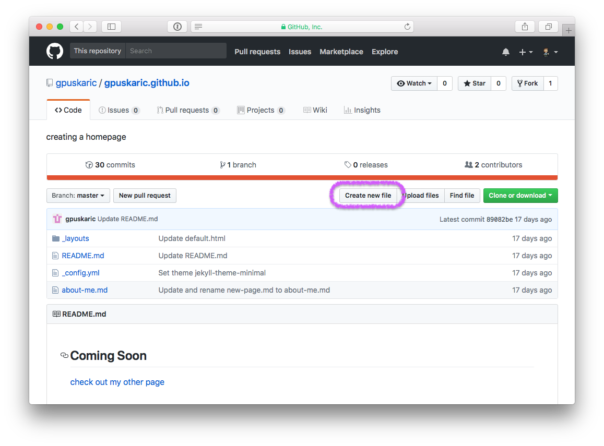
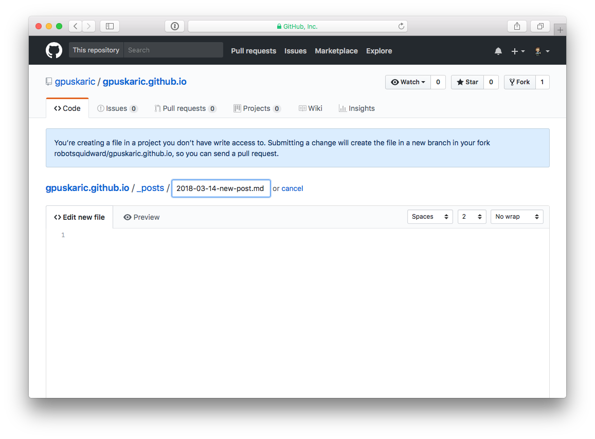

# [gpuskaric.com]()

Greg's landing page and blog.

## Writing Posts

New posts go in the `_posts` directory.  To create a new post, create a new file in the `_posts` directory like this:

### Create a new file

To create a new file, navigate to the `_posts` directory and click on **Create new file** in GitHub.  



Name your file following this format:

```
YYYY-MM-DD-your-posts-name.md
```



After naming your file, you can either start editing it using [markdown]() or you can click the green **Commit changes** button beneath the file editor to add the empty file.

### Front matter

All posts need to begin with some front matter, here's the default for this theme:

```
---
title: "Post Title"
categories:
  - post
  - general
tags:
  - example
  - formatting
---
```

For examples of what posts should or could look like, look at the [list of posts](https://github.com/mmistakes/jekyll-theme-unit-test/tree/master/_posts) used in this site [sample](https://github.com/mmistakes/so-simple-theme).

There's a ton of post types, [here's what these look like rendered](https://mmistakes.github.io/so-simple-theme/posts/) in a un-modified version of your theme - you should be able to map them back to the [sample post markdown](https://github.com/mmistakes/jekyll-theme-unit-test/tree/master/_posts).

### Writing Content

All content is written in **[markdown](https://guides.github.com/features/mastering-markdown/)** - a markup language that is like plain text but some html flair.

#### [Markdown Cheat Sheet](https://github.com/adam-p/markdown-here/wiki/Markdown-Cheatsheet)

If you need examples, look back at those sample [posts](https://github.com/mmistakes/jekyll-theme-unit-test/tree/master/_posts) or even look at this readme file directly in GitHub.  It should be self explanatory.
